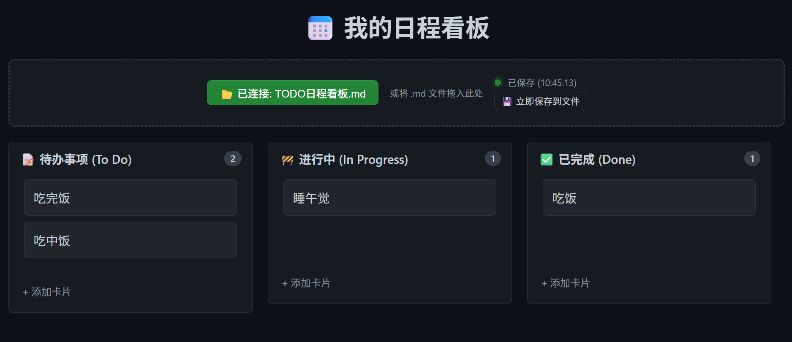

# 这边是笔记本文档总索引

---

## 全笔记索引

### 笔记本tag

- [笔记本tag](笔记目录[脚本生成]/Tag_Index.md)

### 笔记本目录

- [笔记本目录](笔记目录[脚本生成]/All_Notes_Outline.md)

---

## 游戏开发文档

### 游戏渲染的文档链接

- [渲染文档链接汇总](游戏开发/渲染文档汇总.md)

---

## 📝本地TODO看板

- **📝**[[本地网页]日程看板需要浏览器打开](TODO日程看板/TODO日程看板网页.html)

---

## 网页链接

- [[网页]Markdown语法](https://www.runoob.com/markdown/md-tutorial.html)

---

## 本地Tools

### Node
- [Git Boundle 备份工具js 依赖于Node](Tools/启动git备份工具bundle.bat)

### Python
- [备份并压缩整个笔记本.py](Tools/备份并压缩整个笔记本.py)
- [镜像图床重构.py](Tools/镜像图床重构.py)
- [生成目录和标签索引.py](Tools/生成目录和标签索引.py)
- [打开可以连接github的浏览器(需要先关闭浏览器)](<Tools/Github Hosts python/打开可以连接github的浏览器(需要先关闭浏览器).py>)
---
